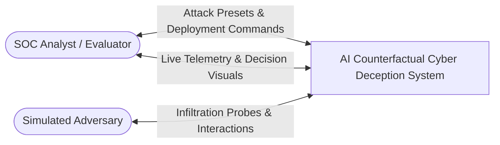
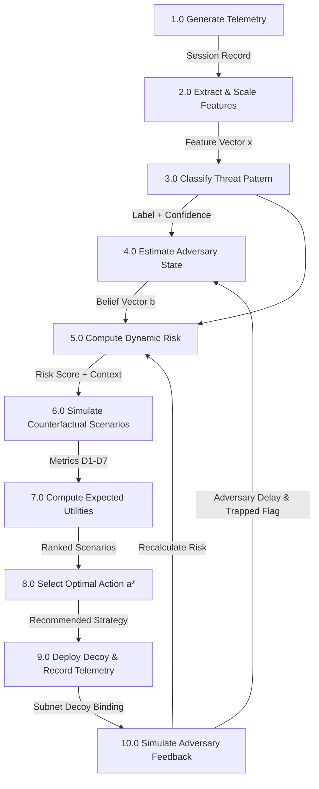
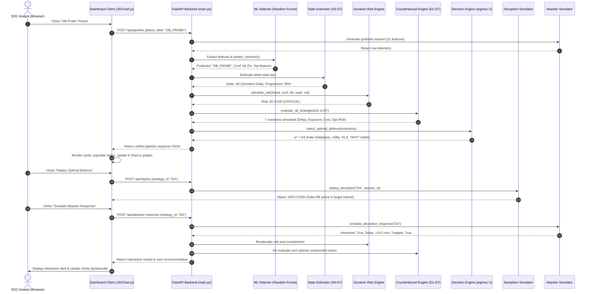

# SYSTEM DESIGN SPECIFICATION DOCUMENT

# AI-BASED COUNTERFACTUAL DEFENCE DECISION FRAMEWORK FOR ADAPTIVE CYBER DECEPTION

---

## 1. Executive Summary & System Overview

The **AI-Based Counterfactual Defence Decision Framework for Adaptive Cyber Deception** is an autonomous, explainable defensive cyber decision platform. It shifts enterprise defense from static honeypots to an intelligent, counterfactual-driven decision paradigm. 

Instead of choosing a defensive action based on hardcoded IF-ELSE rules, the system simulates and compares multiple hypothetical futures ("What-If" scenarios) across seven distinct deception strategies before committing defensive resources.

---

## 2. High-Level System Architecture (HLA)

The architecture is partitioned into four decoupled layers:
1. **Perception & Telemetry Layer**: Session generator, network telemetry collection, and feature scaling.
2. **Intelligence & State Estimation Layer**: Multi-class ML detector (Random Forest), POMDP belief state estimator ($S_0$ to $S_7$), and dynamic risk calculator.
3. **Counterfactual Reasoning & Decision Layer**: "What-If" scenario simulator ($D_1$ to $D_7$), multi-objective utility optimizer, and explainable AI justification engine.
4. **Actuation, Feedback & Presentation Layer**: Simulated decoy deployment, attacker response simulator, RESTful API (FastAPI), and interactive dark SOC dashboard (Chart.js).

```mermaid
graph TD
    subgraph Layer_1 [1. Perception & Telemetry Layer]
        A[Attacker Session Simulator] -->|21 Raw Features| B[Data Collector & Ingestion]
        B -->|Feature Vector| C[StandardScaler Normalization]
    end

    subgraph Layer_2 [2. Intelligence & State Estimation Layer]
        C -->|Scaled Vector x| D[ML Attack Classifier\nRandom Forest: 98.5% F1]
        D -->|Predicted Class + Confidence| E[POMDP Belief State Estimator\nBelief Vector b(s) over S0-S7]
        D -->|Feature Importance| F[Dynamic Risk Assessment Engine\n0-100 Score: Low/Med/High/Crit]
        E --> F
    end

    subgraph Layer_3 [3. Counterfactual Reasoning & Decision Layer]
        F -->|Threat Context| G[Counterfactual Scenario Generator\nEvaluate Options D1 - D7]
        G -->|Hypothetical Metrics| H[Multi-Objective Utility Engine\nSecurity, Delay, Intel vs Cost, Risk]
        H -->|Utility Scores| I[POMDP Decision Engine\na* = argmax E[U(a | b(s))]]
        I -->|Natural Language| J[Explainable AI Engine\n'WHY' Rationale Generator]
    end

    subgraph Layer_4 [4. Actuation, Feedback & Presentation Layer]
        I -->|Optimal Action a*| K[Deception Deployment Simulator]
        K -->|Decoy Active in Subnet| L[Attacker Response Simulator]
        L -->|Dwell Time + State Shift| E
        L -->|Feedback Update| F
        I -.-> M[FastAPI REST Backend]
        M -.-> N[SOC Cyber Defense Dashboard\n6 Dynamic Chart.js Visuals]
    end
```

---

## 3. Data Flow Diagrams (DFD)

### 3.1 DFD Level 0 (Context Diagram)



---

### 3.2 DFD Level 1 (Pipelined Data Flow)



---

## 4. Sequence Diagram (User Interaction & Execution Flow)

The following sequence details what occurs when an operator clicks **"DB Probe"** $\rightarrow$ **"Deploy"** $\rightarrow$ **"Simulate Response"**:



---

## 5. Detailed Component & Module Specifications

| Module / Package | Source Files | Design Responsibilities |
|:---|:---|:---|
| **Simulation Tier** | `simulation/session_generator.py`<br>`simulation/attacker_simulator.py` | Generates 21-feature telemetry using Poisson/Gamma/Beta distributions; tracks adversary progression across states $S_0$–$S_7$. |
| **Detection Tier** | `detection/feature_engineering.py`<br>`detection/detection_model.py`<br>`train_model.py` | Normalizes feature vectors via `StandardScaler`; executes Random Forest multi-class classification; computes Gini feature importance. |
| **Risk Tier** | `risk/risk_engine.py` | Evaluates dynamic composite risk scores ($0-100$) categorized into `LOW`, `MEDIUM`, `HIGH`, `CRITICAL` tiers. |
| **Counterfactual Tier** | `counterfactual/scenario_simulator.py`<br>`counterfactual/counterfactual_engine.py` | Core research novelty. Simulates hypothetical outcomes for strategies $D_1$ to $D_7$ without touching physical infrastructure. |
| **Decision Tier** | `decision/utility_engine.py`<br>`decision/decision_engine.py` | Formulates normalized multi-objective utility; applies $a^* = \arg\max U(D_i)$; generates natural language "WHY" explanations. |
| **Deception Tier** | `deception/deception_simulator.py` | Manages catalogs of deceptive assets ($D_1$–$D_7$), subnet binding, and adversary containment flags. |
| **Benchmark Tier** | `experiments/benchmark_engine.py` | Executes 60-campaign Monte Carlo simulations comparing No Deception, Static, Rule-Based, Standard AI, and Counterfactual AI across 8 KPIs. |
| **Presentation Tier** | `dashboard/templates/index.html`<br>`dashboard/static/style.css`<br>`dashboard/static/dashboard.js`<br>`main.py` | FastAPI RESTful service; SOC dark-mode UI; asynchronous DOM updates; 6 reactive Chart.js visualization widgets. |

---

## 6. Mathematical System Formulation

### 6.1 POMDP Adversary Formulation
$$\text{POMDP} = \langle \mathcal{S}, \mathcal{A}, \mathcal{T}, \mathcal{R}, \Omega, \mathcal{O} \rangle$$
* **$\mathcal{S}$ (State Space):** $\{S_0, S_1, S_2, S_3, S_4, S_5, S_6, S_7\}$:
  * $S_0$: Unknown/Benign | $S_1$: Recon | $S_2$: Initial Access | $S_3$: Credential Attack
  * $S_4$: Privilege Escalation | $S_5$: Lateral Movement | $S_6$: Sensitive DB/Data Access | $S_7$: Exfiltration
* **$\mathcal{A}$ (Action Space):** $\{D_1, D_2, D_3, D_4, D_5, D_6, D_7\}$:
  * $D_1$: No Deception (Baseline) | $D_2$: Fake Login | $D_3$: Fake Server | $D_4$: Fake Database
  * $D_5$: Honeytoken | $D_6$: Decoy Credentials | $D_7$: Decoy File
* **$b(s)$ (Belief State):**
  $$b(s) = P(S_t = s \mid \mathbf{x}), \quad \sum_{s \in \mathcal{S}} b(s) = 1.0$$

### 6.2 Counterfactual Reasoning Model
For candidate strategy $D_i$ under threat context $(A, s, \sigma, C)$:
* **Affinity Score ($\alpha_i$):**
  $$\alpha_i = 0.60 \cdot \mathbb{I}(A \in \text{Targeted}(D_i)) + 0.40 \cdot \mathbb{I}(s \in \text{PrimaryStates}(D_i))$$
* **Expected Delay ($\mathbb{E}[\Delta t]$ in minutes):**
  $$\mathbb{E}[\Delta t \mid D_i] = \text{BaseDelay}(D_i) \cdot (0.50 + 0.50\alpha_i) \cdot P_{\text{engage}}(D_i) \cdot (1.1 - 0.2\sigma)$$
* **Critical Asset Exposure Probability:**
  $$P_{\text{exposure}}(D_i) = C \cdot (0.45 + 0.50\sigma) \cdot \left[ 1.0 - 0.88 P_{\text{engage}}(D_i) \alpha_i \right]$$
* **Security Benefit:**
  $$B_{\text{sec}}(D_i) = 0.60 \cdot (1.0 - P_{\text{exposure}}(D_i)) + 0.40 \cdot (1.0 - P_{\text{progress}}(D_i))$$

### 6.3 Multi-Objective Utility Engine
$$U(D_i) = \frac{w_1 B_{\text{sec}} + w_2 P_{\text{det}} + w_3 \tilde{\Delta t} + w_4 V_{\text{intel}} - w_5 C_{\text{dep}} - w_6 R_{\text{ops}}}{\sum_{j=1}^4 w_j} \times 100$$
Where default configurable weights are:
$w_1 = 0.25$, $w_2 = 0.20$, $w_3 = 0.20$, $w_4 = 0.15$, $w_5 = 0.08$, $w_6 = 0.12$.

### 6.4 Optimal Action Selection
$$a^* = \arg\max_{D_i \in \mathcal{A}} U(D_i \mid b(s), A) \quad \text{subject to } R_{\text{ops}}(D_i) \le R_{\max}$$

---

## 7. Data Dictionary & Schema Design

| Column Name | Data Type | Range / Format | Description |
|:---|:---|:---|:---|
| `session_id` | String | `SESS-[0-9A-F]{8}` | Unique session identifier. |
| `timestamp` | ISO-8601 | `YYYY-MM-DDTHH:MM:SSZ` | Telemetry recording timestamp. |
| `source_ip` | String | IPv4 format | Originating IP of the simulated adversary. |
| `destination_service` | String | Enum (`HTTPS:443`, `MySQL:3306`, etc.) | Targeted application port. |
| `connection_count` | Integer | $1 - 200$ | Active TCP connections in session. |
| `packets_per_second` | Float | $0.0 - 500.0$ pps | Inbound/outbound traffic intensity. |
| `failed_login_count` | Integer | $0 - 200$ | Number of invalid authentication attempts. |
| `successful_login_count`| Integer | $0 - 10$ | Valid authentications recorded. |
| `login_frequency` | Float | Attempts/min | Rate of credential submissions. |
| `port_scan_count` | Integer | $0 - 500$ | Unique ports swept during session. |
| `command_frequency` | Float | Commands/sec | Terminal command submission velocity. |
| `database_query_count` | Integer | $0 - 400$ | Number of SQL statements dispatched. |
| `sensitive_file_access`| Integer | $0 - 100$ | Attempts to inspect sensitive system files. |
| `privilege_escalation` | Integer | $0 - 5$ | Root/Administrator privilege elevation triggers. |
| `lateral_movement_score`| Float | $0.0 - 1.0$ | Internal subnet traversal score. |
| `data_access_volume` | Float | MB | Total data payload extracted/transferred. |
| `session_duration` | Float | Seconds | Total active elapsed time of session. |
| `attacker_sophistication`| Float| $0.05 - 1.0$ | Estimated skill rating of adversary. |
| `attack_stage` | String | Enum (`S0` - `S7`) | Ground-truth state in attack progression. |
| `asset_criticality` | Float | $0.1 - 1.0$ | Sensitivity weighting of targeted asset. |
| `detection_confidence` | Float | $0.0 - 1.0$ | ML classifier prediction probability. |
| `attack_label` | String | Enum (9 classes) | Target attack classification label. |

---

## 8. Technology Stack & Deployment Architecture

```
┌────────────────────────────────────────────────────────┐
│               PRESENTATION / CLIENT TIER               │
│   HTML5 • CSS3 (Dark SOC Theme) • JavaScript (ES6)     │
│   Chart.js 4.x (6 Reactive Visualizations)             │
└──────────────────────────▲─────────────────────────────┘
                           │ HTTP REST / JSON
┌──────────────────────────▼─────────────────────────────┐
│                 APPLICATION / API TIER                 │
│   Python 3.10+ • FastAPI 0.100+ • Uvicorn ASGI Server  │
│   Pydantic Data Validation • CORS Middleware           │
└──────────────────────────▲─────────────────────────────┘
                           │ In-Memory Pipeline
┌──────────────────────────▼─────────────────────────────┐
│             MACHINE LEARNING & DECISION TIER           │
│   Scikit-Learn (Random Forest, SVM, LogisticRegression)│
│   Joblib Serialization • NumPy • Pandas DataFrames     │
│   POMDP Belief Estimator • Counterfactual Simulator    │
└────────────────────────────────────────────────────────┘
```
